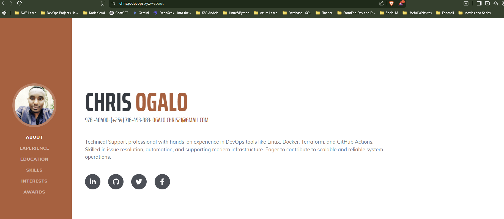

# [Start Bootstrap - Resume](https://startbootstrap.com/theme/resume/)

[Resume](https://startbootstrap.com/theme/resume/) is a resume and CV theme for [Bootstrap](https://getbootstrap.com/) created by [Start Bootstrap](https://startbootstrap.com/). This theme features a fixed sidebar with content sections to build a simple, yet elegant resume.

## Preview

[

**[View Live Preview](https://chris.jodevops.xyz/)**

## Status

[](https://raw.githubusercontent.com/StartBootstrap/startbootstrap-resume/master/LICENSE)
[](https://www.npmjs.com/package/startbootstrap-resume)

## Download and Installation

To begin using this template, choose one of the following options to get started:

- [Download the latest release on Start Bootstrap](https://startbootstrap.com/theme/resume/)
- Install using npm: `npm i startbootstrap-resume`
- Clone the repo: `git clone https://github.com/StartBootstrap/startbootstrap-resume.git`
- [Fork, Clone, or Download on GitHub](https://github.com/StartBootstrap/startbootstrap-resume)

## Usage

### Basic Usage

After downloading, simply edit the HTML and CSS files included with `dist` directory. These are the only files you need to worry about, you can ignore everything else! To preview the changes you make to the code, you can open the `index.html` file in your web browser.

## Bugs and Issues

Have a bug or an issue with this template? [Open a new issue](https://github.com/StartBootstrap/startbootstrap-resume/issues) here on GitHub or leave a comment on the [theme overview page at Start Bootstrap](https://startbootstrap.com/theme/resume/).

# 🚀 Static Website Hosting on AWS (S3 + CloudFront + Route 53 + SSL)

This project demonstrates how to deploy a static website using AWS services — ideal for beginners looking to get hands-on experience with cloud hosting.

## 🔧 Tech Stack

- **Amazon S3** – stores static HTML/CSS/JS files
- **Amazon CloudFront** – global CDN for fast delivery
- **Route 53** – DNS & domain management
- **AWS Certificate Manager** – SSL/TLS certificate for HTTPS
- **HTML, CSS, JavaScript** – static frontend website

---
## ✅ Setup Guide

### 1. Create and Upload Static Files to S3
- Create a public S3 bucket named `yourdomain.com`
- Enable static website hosting
- Upload files using AWS Console or:
  ```bash
  aws s3 sync . s3://yourdomain.com --acl public-read

### 2. Make the Bucket Public
•	Add this Bucket Policy:
{
  "Version": "2012-10-17",
  "Statement": [{
    "Effect": "Allow",
    "Principal": "*",
    "Action": "s3:GetObject",
    "Resource": "arn:aws:s3:::yourdomain.com/*"
  }]
}

### 4. Set Up AWS Certificate Manager (ACM)
Get an SSL/TLS certificate for HTTPS.
- Go to AWS Console > Certificate Manager > Request a certificate
- Choose Public Certificate
- Enter your domain (e.g., yourdomain.com and www.yourdomain.com)
- Choose DNS validation
- Add CNAME record in Route 53 when prompted
- Once validated, the certificate will show as "Issued".

### 5. Set Up CloudFront (for CDN & HTTPS)
CloudFront caches and distributes your site globally, and allows HTTPS.
- Go to CloudFront > Create distribution
- Origin domain: your S3 bucket (choose the bucket endpoint, not the static site URL)
- Viewer protocol policy: Redirect HTTP to HTTPS
- Custom domain: yourdomain.com
- SSL certificate: choose the one from ACM
- Default root object: index.html
✅ After deployment (takes ~10 min), you will get a CloudFront domain like d1234.cloudfront.net

### 6. Register or Use Your Domain in Route 53
Route 53 manages domain records.
- If you have a domain (e.g., from GoDaddy), migrate DNS to Route 53.
Create a hosted zone in Route 53 with your domain name.
Replace NS records in GoDaddy with the ones from Route 53.
- Add an A Record (alias) in Route 53 pointing to your CloudFront distribution.

### 7. Test Your Website
Visit your domain https://yourdomain.com
Should load your static site with HTTPS

You can also try to modify the project and incorporate CI/CD Using Github Actions. 


📘 Lessons Learned
How to host static sites on AWS S3
Working with DNS, SSL and CDNs
Using infrastructure best practices on the cloud


## Copyright and License

Copyright 2013-2023 Start Bootstrap LLC. Code released under the [MIT](https://github.com/StartBootstrap/startbootstrap-resume/blob/master/LICENSE) license.
